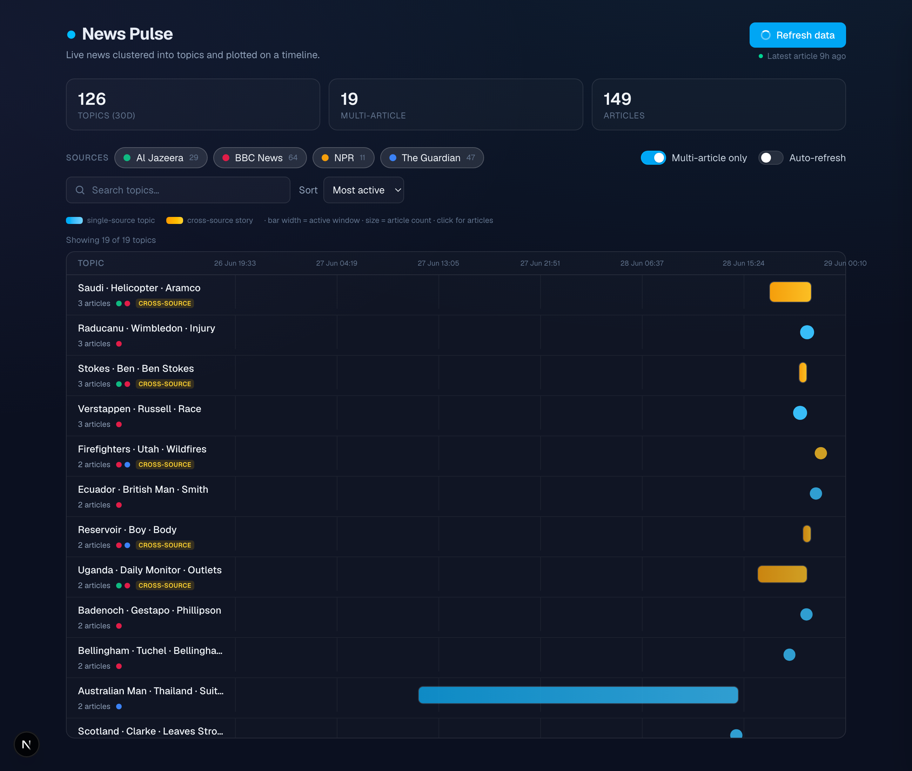
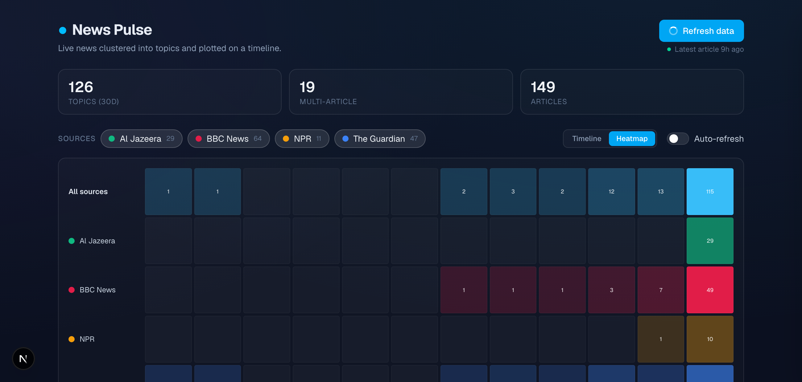

# News Pulse — Topic-Clustered News Timeline

Pulls live articles from several news RSS feeds, automatically groups related
articles into **topic clusters**, and displays those clusters as a visual
**timeline**. Built for the Xponentium full-stack assessment.



Two visualizations — a Gantt-style **timeline** (above) and a calendar-style
**activity heatmap** (below):



## Architecture

```
RSS feeds ──► [ scraper (Python) ] ──► Postgres (Neon) ◄── [ backend (Node/Express) ] ◄── [ frontend (Next.js) ]
              scrape · extract · cluster        shared DB        REST API: clusters/timeline/ingest      timeline UI
```

| Folder | Stack | Responsibility |
|--------|-------|----------------|
| [`/scraper`](scraper) | Python | RSS ingestion, full-text extraction, TF-IDF topic clustering. Writes to Postgres. |
| [`/backend`](backend) | Node.js / Express | REST API serving clusters, articles, and timeline data; triggers the pipeline. |
| [`/frontend`](frontend) | Next.js / React | Custom timeline visualization + cluster explorer. |

The scraper and backend share **one Neon Postgres database** — the scraper
writes, the API reads. Each component has its own README with detail.

## Topic-grouping approach

**TF-IDF + cosine similarity** (Option B). For each article we build a TF-IDF
vector over `title (weighted) + summary + body`, compute pairwise cosine
similarity, link any pair scoring ≥ a threshold, and take the **connected
components** (union-find) as clusters. Each cluster is auto-labelled from its top
aggregated TF-IDF terms.

- **Why this approach:** union-find over a similarity threshold means we don't
  have to pre-choose a cluster count (unlike KMeans), and naturally-singleton
  stories simply stay as their own one-article cluster.
- **Threshold = 0.30** (`CLUSTER_SIMILARITY_THRESHOLD`): tuned empirically — high
  enough that unrelated headlines don't merge, low enough that the same story
  across outlets does. The vectorizer uses English stop-words, unigrams+bigrams
  (to capture multi-word entities like "world cup"), and `sublinear_tf`.
- **Limitation:** it's purely lexical. Two articles about the same event using
  different vocabulary ("ceasefire" vs "truce") may not merge, and the threshold
  is global rather than adapted per topic. Embeddings would help but add heavy
  dependencies. In practice it reliably co-clusters the same story across BBC /
  NPR / Guardian / Al Jazeera (e.g. a plane crash, a helicopter crash, a
  retirement announcement all merged across outlets in testing).

## News sources

BBC News, NPR, The Guardian, Al Jazeera — all public RSS feeds. Defined in
[`scraper/src/feeds.py`](scraper/src/feeds.py); the pipeline is feed-agnostic, so
add/remove sources there.

## Run it locally

You need a Postgres connection string (local or hosted Neon/Supabase).

```bash
# 1. Scraper — creates the schema, ingests, clusters
cd scraper
python3 -m venv venv && source venv/bin/activate
pip install -r requirements.txt
cp .env.example .env            # set DATABASE_URL
python -m src.pipeline

# 2. Backend API  → http://localhost:4000
cd ../backend
npm install
cp .env.example .env            # set DATABASE_URL (same DB)
npm start

# 3. Frontend  → http://localhost:3000
cd ../frontend
npm install
cp .env.example .env.local      # NEXT_PUBLIC_API_URL=http://localhost:4000
npm run dev
```

## Deployment — what runs where, and why

| Component | Platform | Why |
|-----------|----------|-----|
| Database | **Neon** (Postgres) | Hosted free tier; one shared DB the scraper writes and the API reads. |
| Backend API | **Render** (Docker) | The [`Dockerfile`](Dockerfile) bundles Node **and** the Python scraper, so the live `POST /ingest/trigger` can run the pipeline on the same host. See [`render.yaml`](render.yaml). |
| Scraper (scheduled) | **GitHub Actions cron** | [`.github/workflows/ingest.yml`](.github/workflows/ingest.yml) runs the pipeline every 3h (and on-demand) against Neon — keeps data fresh without a long-running worker. |
| Frontend | **Vercel** | First-class Next.js hosting; set root to `frontend`. |

**Env vars (set on the platform, never committed):**
- Render backend: `DATABASE_URL`, `CORS_ORIGIN` (your Vercel URL).
- GitHub Actions: `DATABASE_URL` repo secret.
- Vercel frontend: `NEXT_PUBLIC_API_URL` (your Render URL).

> Ingestion runs two ways by design: on-demand via the API's **Refresh** button
> (subprocess inside the backend container) and on a schedule via GitHub Actions.
> On a host where Python isn't co-located with Node, set `INGEST_ENABLED=false`
> and rely on the scheduled job instead.

## API summary

| Method | Path | Purpose |
|--------|------|---------|
| GET | `/clusters` | Clusters: label, top terms, count, time range. `?source=` |
| GET | `/clusters/:id` | Full cluster + articles (chronological) |
| GET | `/timeline` | Clusters shaped for charting (domain, durations, intensity). `?days=`, `?source=` |
| GET | `/sources` | Distinct sources + counts |
| GET | `/activity` | Per-day article counts by source (powers the heatmap). `?days=` |
| POST | `/ingest/trigger` | Run scrape+cluster; returns `{ jobId }` |
| GET | `/ingest/status/:jobId` | Poll a run |

Full details in [`backend/README.md`](backend/README.md).

## Assumptions

- A 30-day window is applied to the timeline by default so stray evergreen feed
  items (e.g. an "app promo" entry dated months back) don't stretch the axis.
- Cross-source **story merging** is partially achieved as a side effect of
  lexical clustering (same-story articles often share enough terms to co-cluster)
  but is not treated as a separate guaranteed step — it remains the known-hard
  stretch goal.
- "No duplicate articles" is enforced on a `guid` (feed id, falling back to link);
  the same story republished under a new guid can still appear twice.
